# SEZG583 Scalable Services - Assignment Report

**Course:** SEZG583 Scalable Services  
**Assignment:** Microservices Development and Deployment  
**Submission Date:** 10 November 2024

---

## Group Members

- Balaji O M (2024mt03025)
- Balasubramaniyan (2024mt03053)
- Deep Pokala (2024mt03042)
- Jagriti Sharma (2024mt03116)

**GitHub Repository:** https://github.com/wilp-bits-2024mt03053/scalable-services-assignment-1

---

## Table of Contents

1. [Application Description](#1-application-description)
2. [PART 1: DESIGN](#part-1-design)
   - [System Architecture](#21-system-architecture)
   - [Business Capabilities & Services](#22-business-capabilities--services)
   - [System Operations (Commands & Queries)](#23-system-operations-commands--queries)
   - [Service Collaboration](#24-service-collaboration)
3. [PART 2: IMPLEMENTATION](#part-2-implementation)
   - [Technology Stack](#31-technology-stack)
   - [Two Key Microservices](#32-two-key-microservices)
   - [Service Independence](#33-service-independence)
4. [PART 3: DEPLOYMENT](#part-3-deployment)
   - [Docker Containers - Separate per Service](#41-docker-containers---separate-per-service)
   - [Kubernetes Deployment Manifests](#42-kubernetes-deployment-manifests)
   - [Minikube Cluster & Deployment](#43-minikube-cluster--deployment)
   - [Kubernetes Dashboard](#44-kubernetes-dashboard)
   - [Scalability Demonstration](#45-scalability-demonstration-pod-resilience--self-healing)
5. [Implementation & Verification](#5-implementation--verification)
6. [Snapshots & Verification](#6-snapshots--verification)

---

## 1. Application Description

### Real-Time User Event Tracking and Analytics Platform

This project implements a scalable, real-time data streaming pipeline designed to capture, process, and analyze user interaction events from a web application. It serves as a comprehensive example of a modern microservices-based architecture using containerization and orchestration.

#### Project Overview

The system is designed as a multi-stage pipeline that captures user events from a web frontend, processes them in real-time, and stores them in a database for analytics. Each component in the services/ directory is a self-contained microservice with specific responsibility enabling independent development, scaling, and maintenance.

#### Key Features

- Captures user interactions (clicks, page views, form submissions) from React frontend
- Custom tracking hook (react-user-tracker) batches events for efficient transmission
- Real-time event streaming using Apache Kafka
- Event validation and transformation through Python processor
- Persistent storage in PostgreSQL database
- RESTful API (FastAPI) for querying event data with filtering and pagination
- Database administration UI via Adminer
- Complete containerization with Docker - each service in separate container
- Orchestration with Kubernetes and Minikube

#### Data Flow

1. User interactions on React Frontend App
2. Batched HTTP POST to Event Collector (FastAPI)
3. Events published to Kafka topic (user-tracking-events)
4. Event Processor (Python Kafka consumer) reads and validates events
5. Processed events inserted into PostgreSQL database
6. Events API provides query endpoint for analytics
7. Adminer provides database inspection and management

---

## PART 1: DESIGN

### 2.1 System Architecture

The system follows a layered microservices architecture with clear separation of concerns. Each layer handles specific responsibilities and communicates through well-defined interfaces. The architecture progresses from individual services to a fully orchestrated deployment:

**Service-Level Design:** Each component in the services/ directory is a self-contained microservice with a specific responsibility (e.g., real-time-events-collector for ingestion, real-time-events-processor for processing). This separation of concerns allows for independent development, scaling, and maintenance.

**Dockerization:** Every service includes a Dockerfile that packages its source code, dependencies, and runtime into a lightweight, portable container image. This ensures that each service runs in an identical and isolated environment, whether on a local machine or in a cloud-based cluster.

**Local Development:** The docker-compose.yml file defines the entire multi-service application stack for local development. It orchestrates the containers, networks, and volumes, allowing you to spin up the whole system with a single command (make deploy).

**Kubernetes Deployment:** For a production-like environment, the project uses Kubernetes. The manifests in the kube/ directory define how each service is deployed, configured, and exposed. The deploy-minikube.sh script automates the process of building images and applying these manifests to a local Minikube cluster.

#### Architecture Diagram

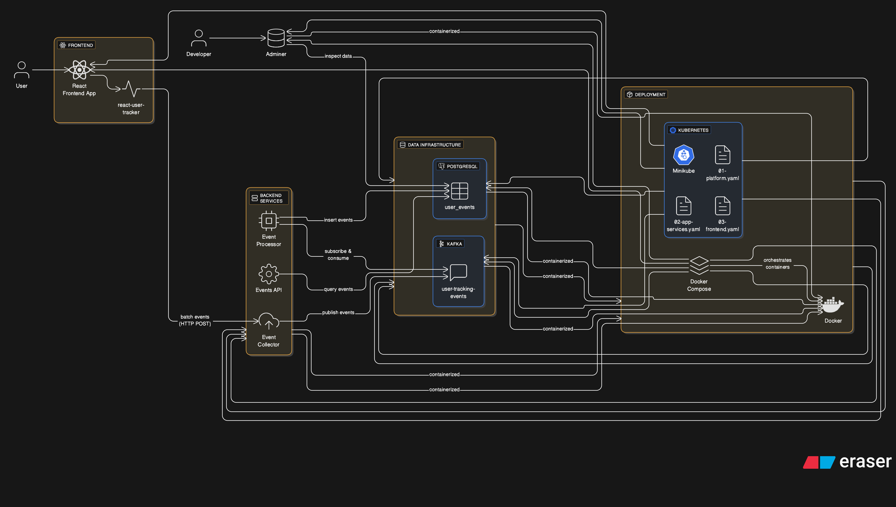

*Figure 1: System Architecture showing the layered microservices design*

#### High-Level Architecture

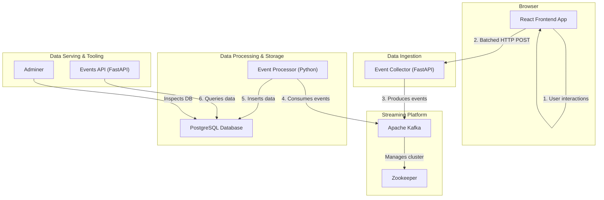

### 2.2 Business Capabilities & Services

| Business Capability | Service | Technology |
|---------------------|---------|-----------|
| **Event Capture** | react-user-tracker | React/TypeScript |
| **Event Ingestion** | real-time-events-collector | FastAPI |
| **Stream Management** | Kafka + Zookeeper | Message Broker |
| **Event Processing** | real-time-events-processor | Python |
| **Data Storage** | PostgreSQL | Database |
| **Query API** | real-time-events-service | FastAPI |
| **Data Inspection** | Adminer | Web UI |

### 2.3 System Operations (Commands & Queries)

#### Commands (Write Operations)
| Operation | Service | Description |
|-----------|---------|-------------|
| **TrackEvent** | Frontend | Captures user interaction |
| **BatchIngestEvents** | Collector | `POST /collect` - Receives event batches |
| **ProduceToKafka** | Collector | Publishes to Kafka topic |
| **ProcessEventBatch** | Processor | Consumes from Kafka |
| **PersistEvent** | Processor | Inserts to PostgreSQL |

#### Queries (Read Operations)
| Operation | Service | Description |
|-----------|---------|-------------|
| **GetEvents** | Events API | `GET /events` with filters (user_id, session_id, event_type, timestamp range, pagination) |
| **HealthCheck** | All Services | `GET /health` - Service status |
| **InspectDatabase** | Adminer | Web UI for DB browsing |

### 2.4 Service Collaboration

```
Frontend ----------> Collector (HTTP)
                        |
                        v
                     Kafka (Producer)
                        |
                        v
                    Processor (Consumer)
                        |
                        v
                    PostgreSQL
                        ^
                        |
Events API -------------+
Adminer ---------------+
```

---

## PART 2: IMPLEMENTATION

### 3.1 Technology Stack

| Layer | Technology |
|-------|------------|
| **Frontend** | React, Next.js, TypeScript |
| **Backend Services** | Python 3.x, FastAPI |
| **Message Broker** | Apache Kafka 7.0.1, Zookeeper |
| **Database** | PostgreSQL 13 |
| **Containerization** | Docker, Docker Compose |
| **Orchestration** | Kubernetes (Minikube) |
| **Build Tools** | Make, Shell Scripts |

### 3.2 Two Key Microservices

#### Service 1: Real-Time Events Collector (FastAPI)
- **Responsibility:** Ingests batched events from frontend via HTTP POST
- **Endpoint:** `POST /collect`
- **Technology:** Python FastAPI
- **Key Feature:** Validates incoming events and publishes to Kafka
- **Scalability:** Can handle multiple concurrent requests
- **Location:** `services/real-time-events-collector/`

#### Service 2: Real-Time Events Processor (Python)
- **Responsibility:** Consumes events from Kafka and persists to database
- **Technology:** Python with Kafka Consumer
- **Key Feature:** Real-time event validation and transformation
- **Scalability:** Can scale horizontally with Kafka consumer groups
- **Location:** `services/real-time-events-processor/`

### 3.3 Service Independence

Each microservice demonstrates full independence:

1. **Separate Codebases:** Each service has its own source directory with independent build/dependency management
2. **Individual Dockerfiles:** Each service builds into its own Docker image with isolated runtime
3. **Independent Deployment:** Services can be deployed, updated, and scaled independently
4. **Decoupled Communication:** Services communicate through HTTP (Frontend→Collector) and Kafka (Collector→Processor)
5. **No Shared Libraries:** Services don't share code; each has its own dependencies
6. **Separate Configuration:** Each service manages its own environment variables and settings

---

## PART 3: DEPLOYMENT

### 4.1 Docker Containers - Separate per Service

Each microservice is packaged in its own Docker container with:
- Dedicated Dockerfile
- Minimal base images (python:3.x-slim, node:alpine)
- Multi-stage builds where applicable
- Health check configurations

**Services and Their Containers:**

| Service | Container Image | Port | Base Image |
|---------|-----------------|------|-----------|
| real-time-events-collector | real-time-events-collector:latest | 8000 | python:3.11-slim |
| real-time-events-processor | real-time-events-processor:latest | - | python:3.11-slim |
| real-time-events-service | real-time-events-service:latest | 8001 | python:3.11-slim |
| real-time-user-tracker-demo | real-time-user-tracker-demo:latest | 3000 | node:alpine |
| Kafka | confluentinc/cp-kafka:7.0.1 | 9092 | - |
| Zookeeper | confluentinc/cp-zookeeper:7.0.1 | 2181 | - |
| PostgreSQL | postgres:13 | 5432 | - |
| Adminer | adminer:latest | 8080 | - |

**Build Commands:**
```bash
# Build individual service images
make build-collector      # real-time-events-collector
make build-processor      # real-time-events-processor
make build-service        # real-time-events-service
make build-demo           # real-time-user-tracker-demo
```

### 4.2 Kubernetes Deployment Manifests

The Kubernetes manifests define the production-like deployment in the `kube/` directory:

#### 01-platform.yaml: Core Infrastructure
- **Kafka StatefulSet:** 1 replica with persistent volume
- **Zookeeper StatefulSet:** 1 replica for Kafka coordination
- **PostgreSQL StatefulSet:** 1 replica with persistent volume
- **Services:** ClusterIP services for internal communication

#### 02-app-services.yaml: Microservices
- **Events Collector Deployment:** 2 replicas with HPA (2-5 pods)
- **Events Processor Deployment:** 2 replicas with HPA (2-5 pods)
- **Events API Deployment:** 2 replicas with HPA (2-5 pods)
- **Services:** NodePort and ClusterIP services

#### 03-frontend.yaml: Frontend Application
- **Frontend Deployment:** 3 replicas with HPA (3-10 pods)
- **Adminer Deployment:** 1 replica for database UI
- **Services:** NodePort services for external access

**Kubernetes Resources Created:**
- **Namespace:** scalable-services (isolated environment)
- **Deployments:** 5 (collector, processor, api, frontend, adminer)
- **StatefulSets:** 3 (kafka, zookeeper, postgres)
- **Services:** 7 (internal and external access)
- **HPAs:** 4 (auto-scaling for stateless services)
- **Secrets:** 1 (PostgreSQL credentials)
- **ConfigMaps:** For service configuration

### 4.3 Minikube Cluster & Deployment

**Deployment Script:** `deploy-minikube.sh`

The script automates the entire deployment process:

1. **Start Minikube:** Initializes local Kubernetes cluster
2. **Configure Docker:** Points Docker CLI to Minikube's Docker daemon
3. **Build Images:** Builds all service images within Minikube
4. **Deploy Manifests:** Applies all YAML configurations
5. **Wait for Ready:** Ensures all deployments are running
6. **Display Commands:** Shows how to access services

**Usage:**
```bash
# Deploy entire stack
./deploy-minikube.sh deploy

# Clean up and remove cluster
./deploy-minikube.sh clean
```

**Access Services:**
```bash
# Frontend Application
minikube service frontend -n scalable-services

# Events API
minikube service events-api -n scalable-services --url

# Adminer Database UI
minikube service adminer -n scalable-services
```

### 4.4 Kubernetes Dashboard

The Kubernetes Dashboard provides visual monitoring and management of cluster resources:

**Access Dashboard:**
```bash
minikube dashboard
```

**Dashboard Views:**

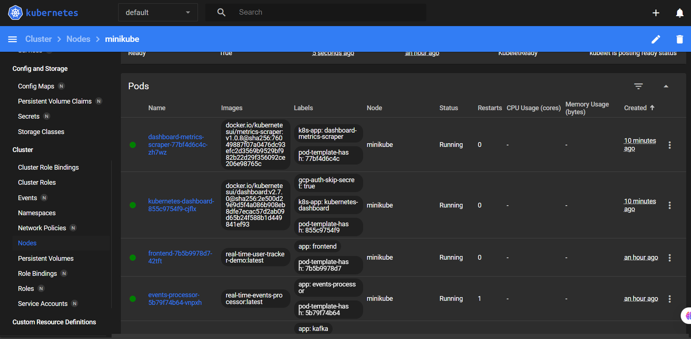

*Figure 2: Kubernetes Dashboard - Cluster Overview showing all resources*

**Key Sections to Review:**

- **Workloads:** View Deployments, ReplicaSets, and Pods
  - Frontend, Events API, Collector, Processor, Kafka, Zookeeper, PostgreSQL
- **Services:** View ClusterIP and NodePort services
- **Autoscaling:** View Horizontal Pod Autoscalers (HPA) for each service
- **Logs:** Access pod logs for debugging
- **Events:** Monitor cluster events and activities

### 4.5 Scalability Demonstration: Pod Resilience & Self-Healing

Kubernetes demonstrates its self-healing capabilities and scalability through its automatic pod recovery mechanism. This section verifies that the platform maintains service availability even when individual pods fail.

#### Demonstration Steps

**Step 1: List Running Pods**
```bash
kubectl get pods -n scalable-services
```
This lists all running pods in the scalable-services namespace, showing the initial deployment state with all services running.

**Step 2: Kill a Pod**
```bash
kubectl delete pod <pod-name> -n scalable-services
```
This forcibly terminates a specific pod (e.g., a frontend or API pod). In a real-world scenario, this simulates a pod crash due to resource exhaustion, application error, or node failure.

**Step 3: List Pods Again**
```bash
kubectl get pods -n scalable-services
```
By running this command immediately after deletion, we observe that Kubernetes automatically creates a replacement pod. The Deployment controller detects that the desired replica count has been violated and instantly schedules a new pod to restore the desired state.

#### Pod Scaling Demonstration

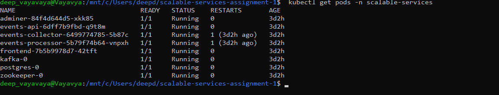

*Figure 3: Pod Scaling Demonstration - Killing and Replacing Pods*

#### Autoscaling Demonstration

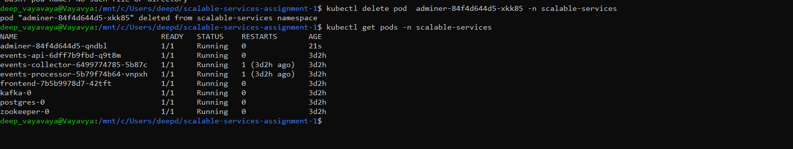

*Figure 4: Autoscaling Pods - Horizontal Pod Autoscaler in Action*

#### Key Observations

- **Self-Healing:** Kubernetes automatically replaces failed pods without manual intervention
- **Replica Management:** The Deployment maintains the specified number of replicas (e.g., 3 replicas for frontend)
- **Continuous Availability:** Other pods continue to serve requests while the replacement pod starts
- **Scalability:** This mechanism allows the system to scale horizontally by increasing replica counts, and Kubernetes automatically distributes them across nodes
- **Load Balancing:** Services automatically load balance traffic across available pods
- **Resource Efficiency:** HPA scales pods based on CPU/memory metrics, optimizing resource usage

---

## 5. Implementation & Verification

### Data Flow Pipeline

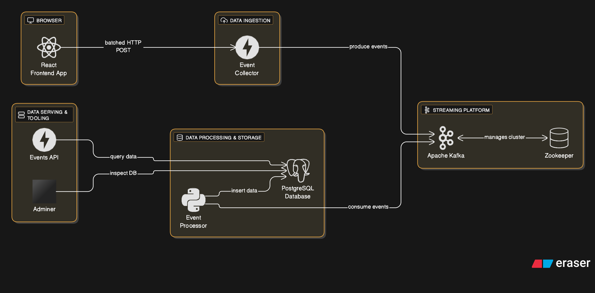

*Figure 5: Data Flow Pipeline*

The complete data flow from frontend to database showing all stages of event processing.

### Frontend Application UI

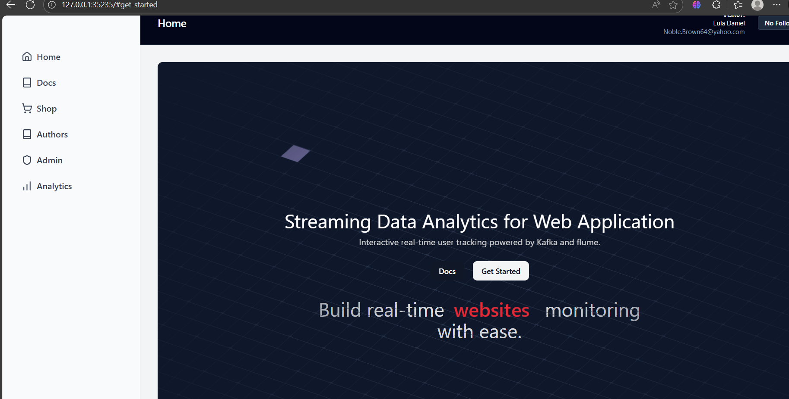

*Figure 6: Frontend Application UI*

The React-based demo application where users interact to generate tracking events.

### Deployed Frontend - Live

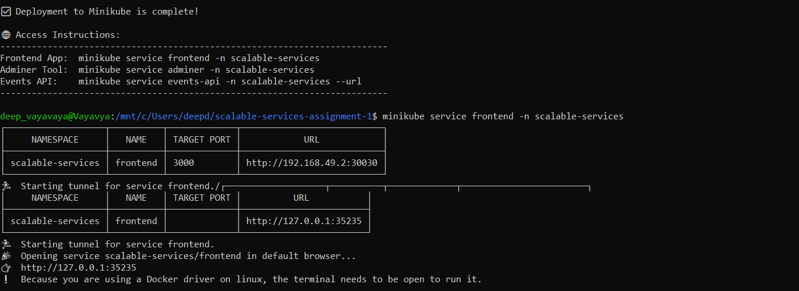

*Figure 7: Deployed Frontend - Live showing active user interactions*

### Database Management

#### Adminer Database Tool

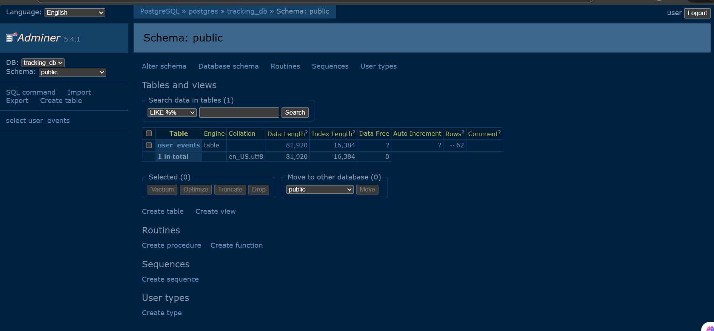

*Figure 8: Adminer Database Tool - Web-based database management interface*

#### Database Schema & Tables

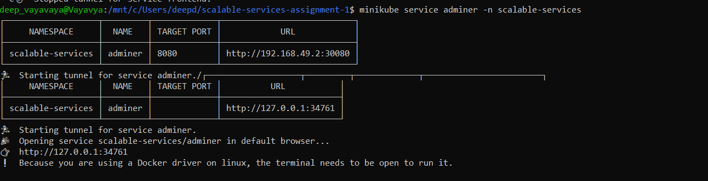

*Figure 9: Database Schema & Tables showing user_events table structure*

**Login Credentials for Adminer:**
- **System:** PostgreSQL
- **Server:** postgres
- **Username:** user
- **Password:** password
- **Database:** tracking_db

### Kubernetes Services Running

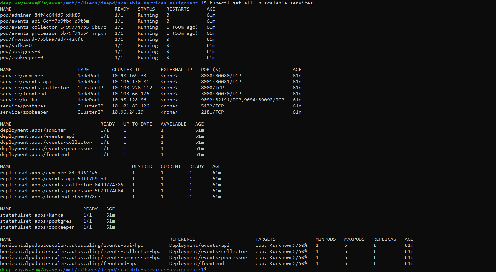

*Figure 10: Kubernetes Services Running - All services exposed and operational*

---

## 6. Snapshots & Verification

### Docker Compose Deployment

Services are containerized and running in isolation:

| Port | Service | Status |
|------|---------|--------|
| 3000 | Frontend App | Running |
| 8000 | Event Collector | Running |
| 8001 | Events API | Running |
| 8080 | Adminer (Database UI) | Running |
| 9092 | Kafka Broker | Running |
| 2181 | Zookeeper | Running |
| 5432 | PostgreSQL | Running |

### Kubernetes Deployment

**Cluster Resources:**
- Namespace: `scalable-services`
- Deployments: 5 (frontend, api, collector, processor, adminer)
- StatefulSets: 3 (kafka, zookeeper, postgres)
- Services: 7 total
- Replicas: 10+ pods running across services
- HPAs: 4 configured for auto-scaling

### Minikube Status


*Figure 11: Minikube Cluster Status showing active cluster*

### Kubernetes Workloads

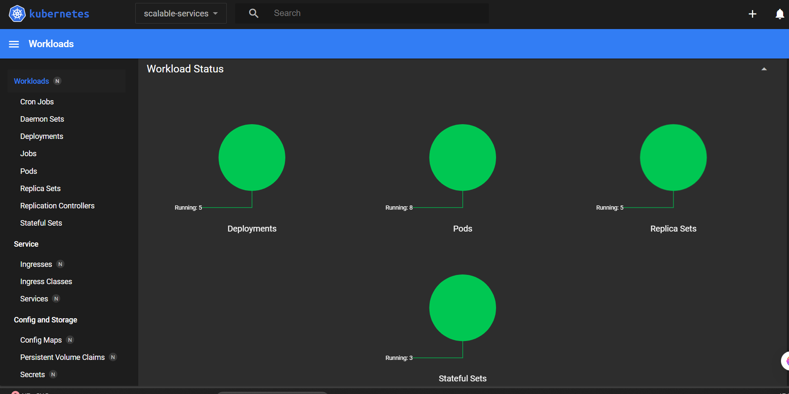

*Figure 12: Kubernetes Workloads - Deployments, ReplicaSets, and Pods*

### Kubernetes Deployments

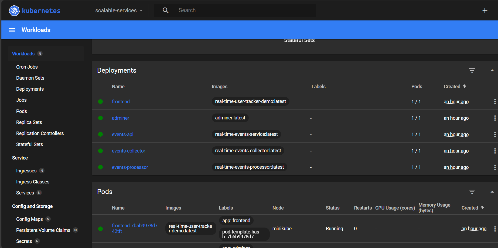

*Figure 13: Kubernetes Deployments showing replica status and readiness*

### Kubernetes Overview

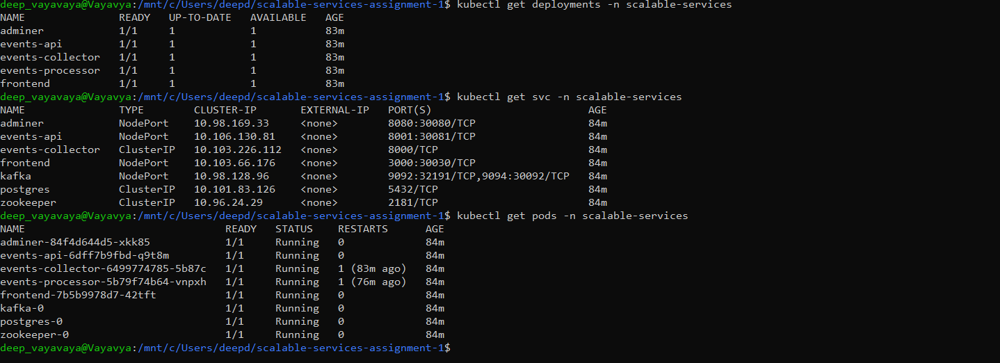

*Figure 14: Kubernetes Overview - Command line summary of all resources*

---

## Getting Started

### Prerequisites

Ensure you have the following tools installed:

- **Docker:** [Installation Guide](https://docs.docker.com/get-docker/)
- **Minikube:** [Installation Guide](https://minikube.sigs.k8s.io/docs/start/)
- **kubectl:** [Installation Guide](https://kubernetes.io/docs/tasks/tools/install-kubectl/)
- **make:** Available on macOS/Linux. For Windows, you can use Chocolatey or WSL
- **envsubst:** Part of the `gettext` package. On macOS: `brew install gettext`

### Option 1: Deploy to Kubernetes with Minikube

This is the recommended approach for a complete, production-like deployment. The `deploy-minikube.sh` script automates the entire process.

1. **Clone the repository:**
   ```bash
   git clone https://github.com/wilp-bits-2024mt03053/scalable-services-assignment-1.git
   cd scalable-services-assignment-1
   ```

2. **Run the deployment script:**
   ```bash
   ./deploy-minikube.sh deploy
   ```
   This script will:
   - Start Minikube if it's not already running
   - Set the Docker environment to point to Minikube's Docker daemon
   - Build all service images directly within Minikube
   - Deploy all Kubernetes resources from the `/kube` directory
   - Wait for all deployments and statefulsets to be ready

3. **Cleaning up:**
   ```bash
   ./deploy-minikube.sh clean
   ```

### Option 2: Run Locally with Docker Compose

For local development and testing, you can use Docker Compose and `make`.

1. **Clone the repository** (if you haven't already)

2. **Deploy the stack:**
   ```bash
   make deploy
   ```

3. **Stopping the stack:**
   ```bash
   make clean
   ```

### Building Individual Service Images

If you need to build or rebuild a specific service's Docker image without running the full deployment:

```bash
make build-collector  # real-time-events-collector
make build-processor  # real-time-events-processor
make build-service    # real-time-events-service
make build-demo       # real-time-user-tracker-demo
```

### Accessing Services

#### On Minikube

```bash
# Frontend Application
minikube service frontend -n scalable-services

# Adminer (Database UI)
minikube service adminer -n scalable-services

# Events API
minikube service events-api -n scalable-services --url

# Kubernetes Dashboard
minikube dashboard
```

#### On Docker Compose

| Port | Service | URL |
|------|---------|-----|
| 3000 | Frontend App | http://localhost:3000 |
| 8080 | Adminer | http://localhost:8080 |
| 8001 | Events API | http://localhost:8001/events |
| 8000 | Event Collector | (internal) |

**Adminer Credentials:**
- System: PostgreSQL
- Server: postgres
- Username: user
- Password: password
- Database: tracking_db

---

## Directory Structure

```
scalable-services-assignment-1/
├── kube/
│   ├── 01-platform.yaml             # Kafka, Zookeeper, PostgreSQL
│   ├── 02-app-services.yaml         # Backend services
│   └── 03-frontend.yaml             # Frontend deployment
├── services/
│   ├── react-user-tracker/          # React tracking hook
│   ├── real-time-events-collector/  # Event ingestion service
│   ├── real-time-events-processor/  # Kafka consumer service
│   ├── real-time-events-service/    # Events query API
│   └── real-time-user-tracker-demo/ # Frontend demo app
├── docs/
│   ├── report/                      # Assignment reports
│   └── snapshots/                   # Deployment screenshots
├── deploy-minikube.sh               # Kubernetes deployment script
├── docker-compose.yml               # Docker Compose for local development
├── Makefile                         # Build and deployment commands
├── README.md                        # Project overview
└── ASSIGNMENT_REPORT.md             # This comprehensive report
```

---

## Code Formatting

A helper script is provided to format all code in the repository.

```bash
./formatter.sh
```

## Makefile Commands

| Command | Description |
|---------|-------------|
| `make deploy` | Cleans environment, builds images, and starts services |
| `make up-prod` | Starts all services without cleaning |
| `make down-prod` | Stops and removes containers/networks |
| `make clean` | Stops and removes containers, networks, and volumes |
| `make logs-prod` | Tails logs from all running services |
| `make build-collector` | Builds event collector image |
| `make build-processor` | Builds event processor image |
| `make build-service` | Builds events API image |
| `make build-demo` | Builds frontend demo image |