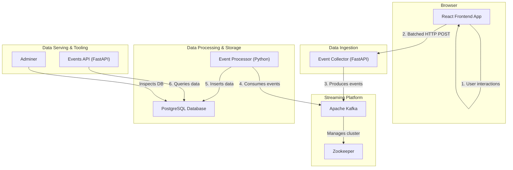

# Real-Time User Event Tracking and Analytics Platform

This project implements a scalable, real-time data streaming pipeline designed to capture, process, and analyze user interaction events from a web application. It serves as a comprehensive example of a modern, microservices-based architecture using containerization and orchestration.

## Authors

- Balaji O M { 2024mt03025 }
- Balasubramaniyan { 2024mt03053}
- Deep Pokala {2024mt03042 }
- Jagriti Sharma {2024mt03116}

## Table of Contents

- [Architecture Overview](#architecture-overview)
- [Core Technologies](#core-technologies)
- [Getting Started](#getting-started)
  - [Prerequisites](#prerequisites)
  - [Option 1: Deploy to Kubernetes with Minikube](#option-1-deploy-to-kubernetes-with-minikube)
  - [Option 2: Run Locally with Docker Compose](#option-2-run-locally-with-docker-compose)
- [Accessing Services](#accessing-services)
- [Code Formatting](#code-formatting)
- [Makefile Commands](#makefile-commands)
- [Directory Structure](#directory-structure)

## Architecture Overview

The system is designed as a multi-stage pipeline that captures user events from a web frontend, processes them in real-time, and stores them in a database for analytics.



**Data Flow:**

1.  **Event Generation**: A user interacts with the **React Frontend App**. A custom tracking hook (`react-user-tracker`) batches these events.
2.  **Ingestion**: The batched events are sent via an HTTP POST request to the **Event Collector** service.
3.  **Streaming**: The collector publishes the events into a `user-tracking-events` topic in **Apache Kafka**, which acts as a durable and scalable buffer.
4.  **Processing**: The **Event Processor** (a Python-based Kafka consumer) subscribes to the topic, reads events in real-time, and validates them.
5.  **Storage**: The processor inserts the structured event data into the `user_events` table in the **PostgreSQL** database.
6.  **Serving**: The **Events API** provides an endpoint to query the stored events.
7.  **Inspection**: Developers can use **Adminer** to connect to the database and view the data.

### From Service to Production: Design and Deployment

This project is designed for scalability and portability, progressing from individual services to a fully orchestrated deployment.

- **Service-Level Design**: Each component in the `services/` directory is a self-contained microservice with a specific responsibility (e.g., `real-time-events-collector` for ingestion, `real-time-events-processor` for processing). This separation of concerns allows for independent development, scaling, and maintenance.

- **Dockerization**: Every service includes a `Dockerfile` that packages its source code, dependencies, and runtime into a lightweight, portable container image. This ensures that each service runs in an identical and isolated environment, whether on a local machine or in a cloud-based cluster.

- **Local Development with Docker Compose**: The `docker-compose.yml` file defines the entire multi-service application stack for local development. It orchestrates the containers, networks, and volumes, allowing you to spin up the whole system with a single command (`make deploy`). This is ideal for testing the interactions between services in a controlled environment.

- **Kubernetes Deployment with Minikube**: For a production-like environment, the project uses Kubernetes. The manifests in the `kube/` directory define how each service is deployed, configured, and exposed.
  - `01-platform.yaml`: Sets up the core infrastructure, including Kafka, Zookeeper, and PostgreSQL.
  - `02-app-services.yaml`: Deploys the backend microservices (collector, processor, and API).
  - `03-frontend.yaml`: Deploys the user-facing web application.
  
The `deploy-minikube.sh` script automates the process of building images and applying these manifests to a local Minikube cluster, simulating a real-world cloud deployment.

## Core Technologies

- **Frontend**: React (Next.js)
- **Backend Services**: Python (FastAPI)
- **Message Broker**: Apache Kafka & Zookeeper
- **Database**: PostgreSQL
- **Containerization**: Docker
- **Orchestration**: Kubernetes (via Minikube), Docker Compose
- **Build/Task Runner**: `make`

## Getting Started

This project can be run in two ways: in a production-like Kubernetes environment using Minikube, or in a local development environment using Docker Compose.

### Prerequisites

Ensure you have the following tools installed:
- **Docker**: [Installation Guide](https://docs.docker.com/get-docker/)
- **Minikube**: [Installation Guide](https://minikube.sigs.k8s.io/docs/start/)
- **kubectl**: [Installation Guide](https://kubernetes.io/docs/tasks/tools/install-kubectl/)
- **make**: Available on macOS/Linux. For Windows, you can use Chocolatey or WSL.
- **envsubst**: Part of the `gettext` package. On macOS: `brew install gettext`.

### Option 1: Deploy to Kubernetes with Minikube

This is the recommended approach for a complete, production-like deployment. The `deploy-minikube.sh` script automates the entire process.

1.  **Clone the repository**:
    ```bash
    git clone https://github.com/wilp-bits-2024mt03053/scalable-services-assignment-1.git
    cd scalable-services-assignment-1
    ```

2.  **Run the deployment script**:
    ```bash
    ./deploy-minikube.sh deploy
    ```
    This script will:
    - Start Minikube if it's not already running.
    - Set the Docker environment to point to Minikube's Docker daemon.
    - Build all service images directly within Minikube.
    - Deploy all Kubernetes resources from the `/kube` directory.
    - Wait for all deployments and statefulsets to be ready.

3.  **Cleaning up**:
    To tear down the entire Minikube stack, including the cluster and all resources:
    ```bash
    ./deploy-minikube.sh clean
    ```

### Option 2: Run Locally with Docker Compose

For local development and testing, you can use Docker Compose and `make`.

1.  **Clone the repository** (if you haven't already).

2.  **Deploy the stack**:
    This command builds the images and starts all services.
    ```bash
    make deploy
    ```

3.  **Stopping the stack**:
    To stop and remove all containers, networks, and volumes:
    ```bash
    make clean
    ```

## Accessing Services

### On Minikube

The `deploy-minikube.sh` script will provide you with the correct commands to access the services.

- **Frontend Application**: `minikube service frontend -n scalable-services`
- **Adminer (Database UI)**: `minikube service adminer -n scalable-services`
- **Events API**: `minikube service events-api -n scalable-services --url`

### On Docker Compose

The services are exposed on `localhost` at the following ports:

| Port   | Service                       | URL                               |
| :----- | :---------------------------- | :-------------------------------- |
| `3000` | Frontend App                  | [http://localhost:3000](http://localhost:3000) |
| `8080` | Adminer (Database UI)         | [http://localhost:8080](http://localhost:8080) |
| `8001` | Events API                    | [http://localhost:8001/events](http://localhost:8001/events) |
| `8000` | Event Collector               | N/A (used internally by frontend) |

To log in to Adminer, use the following credentials:
- **System**: `PostgreSQL`
- **Server**: `postgres`
- **Username**: `user`
- **Password**: `password`
- **Database**: `tracking_db`

## Code Formatting

A helper script is provided to format all code in the repository.

```bash
./formatter.sh
```

## Makefile Commands

The `Makefile` provides shortcuts for managing the Docker Compose environment.

| Command                | Description                                                              |
| :--------------------- | :----------------------------------------------------------------------- |
| `make deploy`          | Cleans the environment and deploys all services from scratch.            |
| `make up`              | Builds and starts all services without cleaning.                         |
| `make down`            | Stops and removes all containers and networks.                           |
| `make clean`           | Stops and removes containers, networks, **and volumes** (data is lost).  |
| `make logs`            | Tails the logs from all running services.                                |
| `make build-*`         | Builds a specific service image (e.g., `make build-collector`).          |

## Directory Structure

```
.
├── kube/                   # Kubernetes manifests
├── services/               # Source code for all microservices
│   ├── react-user-tracker/         # The reusable React tracking hook
│   ├── real-time-events-collector/ # Ingestion service
│   ├── real-time-events-processor/ # Kafka consumer service
│   ├── real-time-events-service/   # API service
│   └── real-time-user-tracker-demo/  # Frontend demo application
├── deploy-minikube.sh      # Main deployment script for Kubernetes
├── docker-compose.yml      # Docker Compose file for local development
├── Makefile                # Makefile for Docker Compose management
└── README.md               # This file
```